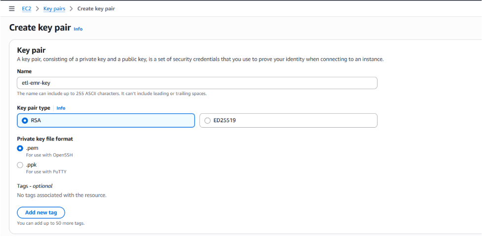
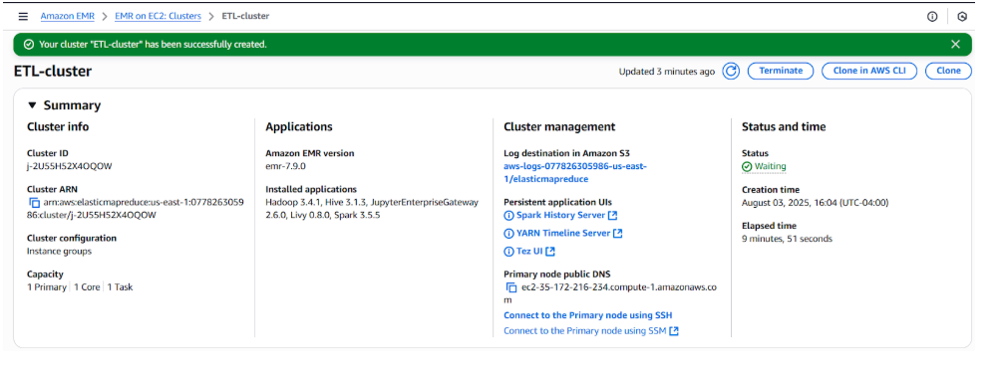
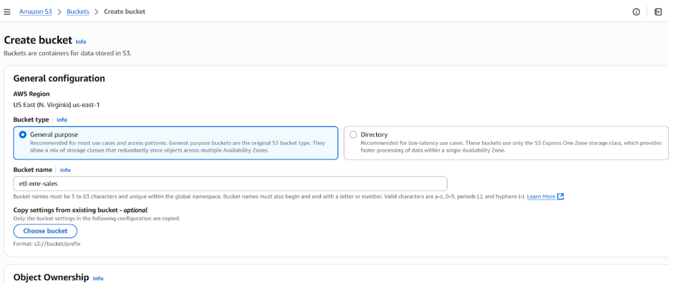
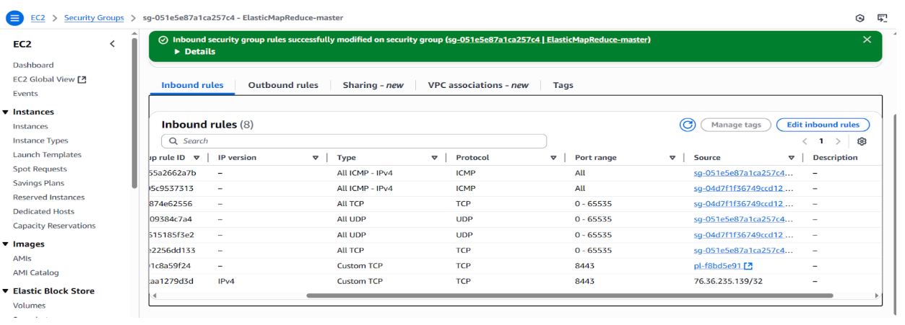
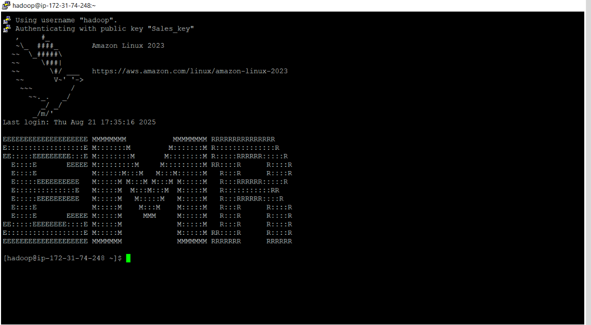
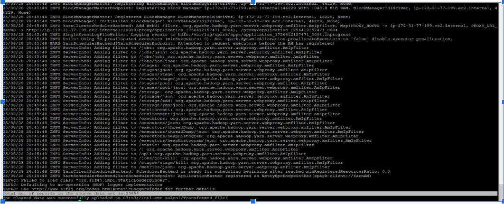
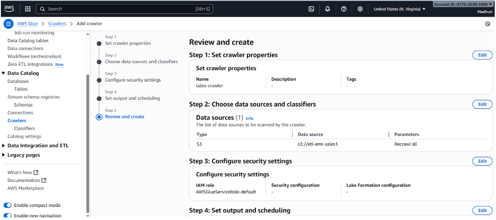
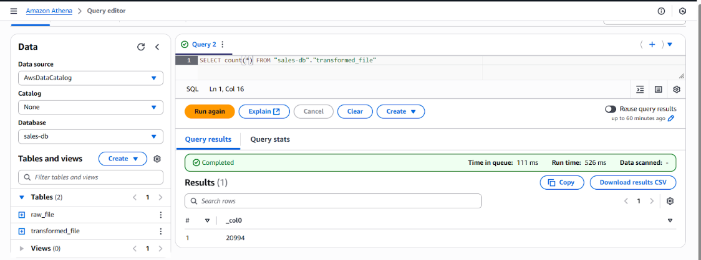

# AWS-DATA-PIPELINE-PROJECT-EC2-EMR-S3-GLUE-ATHENA-PYSPARK
In this project, we are designing and implementing a batch data processing pipeline using AWS and PySpark.

Data Ingestion: The source data, initially available as CSV files in the local environment, is migrated into an Amazon S3 bucket under the raw/ directory. Data security is ensured by configuring appropriate IAM roles and key pairs on the EC2 instance for encryption and controlled access.

Data Transformation: Using PySpark on an Amazon EMR cluster, we perform required transformations such as record counts, string replacements (e.g., handling delimiters), and schema adjustments. The transformed data is then written back into the S3 bucket under the transformed/ directory in an optimized format.

Data Consumption: Once available in the transformed/ folder, the data is exposed via Amazon Athena, enabling downstream teams to query the data directly. These curated tables then serve as the foundation for business dashboards and reporting, providing insights to end customers.

## Use Case
Monthly sales data is delivered as CSV files into an Amazon S3 bucket, but the raw data is not ready for analysis. We need an automated pipeline that processes this data using Amazon EMR (Spark), applies required transformations, and stores the cleaned output in a curated S3 bucket. The processed data should then be made queryable through AWS Glue Data Catalog and Amazon Athena for analysts and data scientists to use.

### What you will learn

- How to create and setup an Amazon EMR cluster
- How to submit a PySpark job on EMR
- How to integrate EMR with Amazon S3
- How to integrate S3 bucket with Amazon Athena

## STEP 1

We are configuring Amazon EC2 for compute resources, Amazon EMR for scalable data processing, and Amazon S3 as the central data storage layer.

- Open EC2 instance and create key pair by giving name.
  
choose private key file format .pem or .ppk based on your usage.

- Configure the EMR cluster by specifying the cluster name, keeping the default settings, and assigning the appropriate IAM role to the EC2 instances and Choose your previously created EC2 key pair under Security and Access.

- Set up an S3 bucket for data storage, then add two subfolders: raw_file for raw data and transformed_file for processed data.

-- Under raw_file upload the Salesdata.CSV 

- Open Security Groups and Add an inbound rule to the master node's security group to allow access from your IP address.
  

## STEP 2
  After setting up the required AWS resources, connect to the EMR cluster and run the PySpark script. Since I'm using Windows, there are several ways to transfer the script from the local machine to the cluster and execute it.

- I used WinSCP to transfer the script to the EMR cluster by providing the host name, and then connected to the cluster using PuTTY with the .ppk key file.

- After connecting to the cluster, run the sales.py script and submit it as a PySpark job.
## Submit : spark-submit sales.py

- After the job completes, check the transformed_file sub folder in the S3 bucket to view the processed data in Parquet format.

## STEP 3

The transformed data is now stored in Amazon S3 in Parquet format. To make it easier for data analysts and data scientists to query using SQL, we can expose it as a database table.
This can be done in two steps:

1.Run an AWS Glue Crawler to create a table in the Glue Data Catalog based on the S3 data.

2.Use Amazon Athena to query and validate the results.

## 1 Creating an AWS Glue Data Catalog
- Navigate to the AWS Glue crawler console and click on Create Crawler.
- Give a name for the Glue Crawler (sales-crawler)
- Add the data source as S3 bucket where you have your transformed and processed data (s3://etl-emr-sales/transformed_file)
- Attach the IAM role (AWSGlueServiceRole-default)
- Create a database by clicking on Add database and select the same from dropdown menu (sales-db)
- Review and verify all the details and click on Create crawler.
- Once the crawler is created, select the crawler and click on Run
- Once the crawler finishes its run, you will see detected tables

With the Glue Data Catalog table created, we can now use Amazon Athena to query the data with SQL.

## 2 Querying output data using Amazon Athena standard SQL
- Open Athena query editor, you can keep Data Source as the default AwsDataCatalog and select sales-db for Database and run the following query.

### SELECT * FROM "sales-db"."transformed_file";

### SELECT count(*) FROM "sales-db"."transformed_file";

